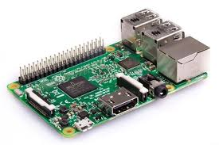
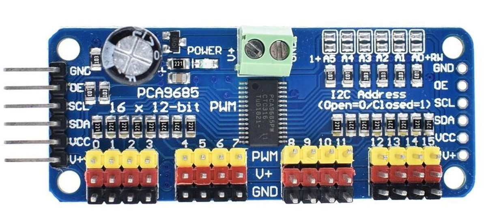
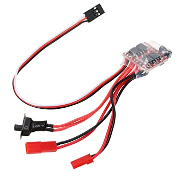
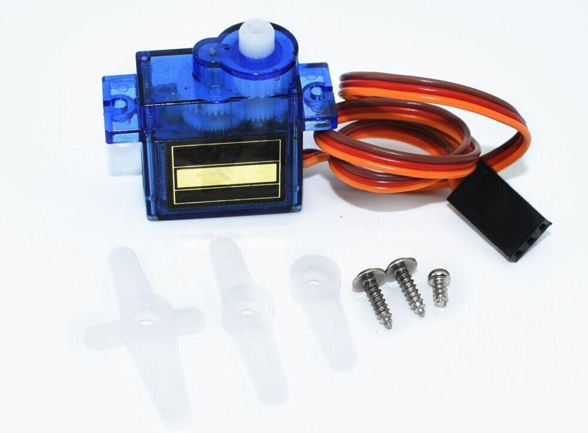

# Hardware Requirements

###1. Raspberry pi 3b

######Description and specifications:
ARM microprocessor where training evaluation takes place by
controlling steering and throttle.  

* Broadcom BCM2837 64bitARMv7 Quad Core Processor powered Single Board
Computer running at 1.2GHz
* 1GBRAM
* BCM43143 WiFion board
* Bluetooth Low Energy (BLE) on board
* 40pin extended GPIO
* USB 2 ports
* Full size HDMICSI camera port for connecting the Raspberry Pi camera
* DSI display port for connecting the Raspberry Pi touch screen display
* Micro USB power source supports up to 2.4 Amps

###### [Link to buy](https://www.banggood.in/Raspberry-Pi-3-Model-B-ARM-Cortex-A53-CPU-1_2GHz-64-Bit-Quad-Core-1GB-RAM-10-Times-B-p-1041862.html?rmmds=buy&cur_warehouse=CN)

###2. PCA9685 driver
######Description and specifications:
The PCA9685 is an I2C-bus controlled 16-channel LED or
(servo) controller optimized for Red/Green/Blue/Amber (RGBA) color backlight-
ing applications.

{: style="height:108px;width:310px"}

* 16 LED drivers
* 1 MHz Fast-mode Plus compatible I2C-bus interface with 30 mA high drive capability on SDA output for driving high capacitive buses
* Operating power supply voltage range of 2.3 V to 5.5 V
* 25 MHz typical internal oscillator

###### [Link to buy](https://www.banggood.in/PCA9685-16-Channel-12-bit-PWM-Servo-Motor-Driver-I2C-Module-p-1170343.html?rmmds=search&cur_warehouse=CN)

###3. RC Car Chassis
######Description and specifications:
HSP 94186 Brushed RC Car

* NiMH-7.2V-1100mAh battery
* Powerful motor: Rc380
* Scale: 1/16
* Controller: 2.4G 2CH
###### [Link to buy](https://www.banggood.in/HBX-18859E-RC-Car-1-or-18-2_4G-4WD-Off-Road-Electric-Powered-Crawler-p-1282278.html?rmmds=search&cur_warehouse=CN)

###4. 10000mAh Mi Power Bank 2i
######Description:
To supply power to the Raspberry Pi.

* Lithium Polymer Battery
* Rated capacity: 3.85V/10000mAh
* Output: 18W max (5.1V/2.4A, 9V/2A, 12V/1.5A)

###### [Link to buy](https://www.amazon.in/Mi-10000mAH-Li-Polymer-Power-Charging/dp/B07VZRJQX1)

Note: 
1. Make sure that the output current rating of the power bank is 2.4A or else the Raspberry Pi will face connectivity issues. 
2. Use an appropriate cable (suitable for fast charging or which supports 2.4A) for connecting the Raspberry Pi to the Power Bank.

###5. 3D printed parts
######Description:
Required to support Processor, servo driver and camera.

###6. 16GB Micro SD Card
######Description:
Used for flashing Raspbian os act as a Read only memory(ROM).

###7. Wide Angle Raspberry Pi Camera:
######Description and specifications:
* Fisheye Lens, offers wider field of view
* 5 megapixel OV5647 sensor
* Field of View : 160 degree
###### [Link to buy](https://www.banggood.in/Camera-Module-For-Raspberry-Pi-4-Model-B-3-Model-B-2B-B-A-p-1051437.html?rmmds=search&cur_warehouse=CN)

###8. Electronic Speed Controller(ESC):
######Description and specifications:
* Powerday RC ESC 10A Brushed Motor Speed Controller for RC Car and Boat Tank with Brake
* Driver frequency: 2KHz
* Dimensions(L*W*H): 23*21*6.0mm
* Current(A):10A 
{: style="height:266px;width:266px"}
###### [Link to buy](https://www.banggood.in/10A-ESC-Brushed-Speed-Controller-For-RC-Car-And-Boat-p-908719.html?rmmds=search&cur_warehouse=CN)

###9. Servo:
######Description and specifications:
* Robodo SG 90 Tower Pro Micro Servo Motor
* Torque: 1.8 kgcm
* Weight: 9 gram
* Gear Type: Plastic

{: style="height:180px;width:245px"}

###### [Link to buy](https://www.banggood.in/TowerPro-SG90-Mini-Micro-Digital-Servo-9g-For-RC-Models-p-984114.html?rmmds=search&cur_warehouse=CN)